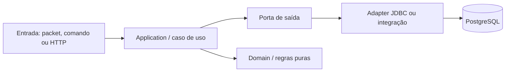

# Padrão de desenvolvimento L2 NewEra

## Fluxo obrigatório para mudanças

Toda feature nova deve ser desenvolvida em uma branch criada a partir de `main`, seguindo o padrão:

```text
feature/<numero>-<nome-da-feature>
```

Todo fix/hotfix deve seguir:

```text
fix/<numero>-<nome-do-fix>
```

O número deve ser sequencial e o nome deve ser curto, descritivo e em kebab-case.

Para cada solicitação de feature, fix ou hotfix:

1. Atualizar `main` com `git pull --ff-only` e criar a branch correspondente a partir dela; nunca desenvolver diretamente em `main`.
2. Implementar a mudança na branch de trabalho.
3. Compilar e validar o projeto.
4. Construir as imagens Docker a partir da própria branch.
5. Subir o stack completo com Docker Compose e validar banco, LoginServer, GameServer, portas e logs.
6. Corrigir qualquer falha encontrada na mesma branch antes de abrir o Pull Request; não transformar falhas detectadas nessa etapa em hotfix separado.
7. Fazer commit com uma mensagem seguindo Conventional Commits.
8. Publicar a branch no remoto.
9. Criar o Pull Request da branch de trabalho para `main`; não fazer merge automático localmente.
10. Aguardar o merge do Pull Request antes de iniciar a próxima feature/fix.
11. Após o merge aprovado, atualizar `main`, reconstruir as imagens e iniciar LoginServer, GameServer e Proxy a partir de `main` para validação final.
12. Informar o commit, a branch e os resultados da compilação, imagem e inicialização.

Alterações de runtime, banco local, caches, certificados e arquivos gerados não devem ser commitadas. A branch `main` recebe mudanças somente por Pull Request. A branch `dev` fica fora do fluxo padrão enquanto o projeto tiver um único desenvolvedor; se for retomada no futuro, deverá ser explicitamente solicitada.

## Regra de testes por cenário

Toda mudança deve incluir pelo menos um teste específico para o cenário alterado, além da compilação e da suíte existente. Quando a mudança envolver persistência, adicionar testes unitários para as regras locais e testes de integração para o fluxo no banco; SQLite pode ser usado nesses testes isolados por ser leve, enquanto o Compose/PostgreSQL deve validar a integração oficial.

Exemplos: uma alteração em clãs deve testar criação, persistência, consulta e remoção de um clã; uma alteração em NPC shops deve testar carregamento e compra; uma alteração em Olympiad deve testar o estado persistido e sua recuperação. O teste deve reproduzir o risco que motivou a mudança, e não apenas verificar que uma classe foi carregada.

## Convenções de commits

Usar, conforme o caso: `feat:`, `fix:`, `hotfix:`, `refactor:`, `docs:`, `test:` ou `chore:`.

## Ambiente local

O ambiente oficial de desenvolvimento/produção usa PostgreSQL via Docker Compose (JDBC `jdbc:postgresql`). SQLite continua disponível apenas como compatibilidade legada para testes isolados. Para executar os módulos com segurança, usar `--no-daemon --no-parallel` e um `GRADLE_USER_HOME` fora do versionamento.

## Baseline arquitetural e documentação

O mapa atual do sistema está em [`docs/architecture/system-map.md`](docs/architecture/system-map.md). Ele é a referência inicial para módulos, fluxo de execução, persistência e evolução para produção.

As seguintes regras valem para mudanças de arquitetura:

1. Antes de mover pacotes, renomear módulos ou separar serviços, atualizar o mapa de dependências e confirmar os pontos de entrada reais no código.
2. Não considerar um módulo como integrado apenas porque ele existe no Gradle ou está descrito no README. A integração precisa ser confirmada por imports, wiring de inicialização ou testes executáveis.
3. Alterações de persistência devem documentar o comportamento em caso de logout, shutdown normal, falha de processo e recuperação após crash.
4. O estado de runtime do jogador não deve ser versionado no Git. Banco PostgreSQL, SQLite runtime, WAL/SHM, logs, caches, `hexid.txt` e arquivos gerados pertencem à máquina/ambiente e devem permanecer ignorados.
5. Documentação de produção deve separar claramente: estado atual local, decisão pretendida, riscos conhecidos e trabalho necessário para implementação.

### Arquitetura-alvo de pastas — Clean Architecture incremental

Esta é a arquitetura futura do L2 NewEra. Ela é uma regra de organização para
novos componentes e para refatorações graduais; não autoriza mover todo o
projeto de uma vez nem reescrever o protocolo do jogo.

```text
L2 NewEra/
├── modules/                 # código compilável, separado por contexto
│   └── <contexto>/
│       └── src/main/
│           ├── domain/      # entidades, value objects e regras puras
│           ├── application/ # casos de uso e portas (interfaces)
│           ├── adapters/    # entrada: packets/API; saída: JDBC/integrações
│           └── bootstrap/   # composição, configuração e inicialização
├── database/                # migrations, seeds e fixtures versionáveis
├── config/                  # defaults e contratos de configuração
├── deploy/                  # Docker Compose, imagens e deployment
├── tools/                   # runtime, migração e manutenção operacional
├── docs/                    # arquitetura, ADRs, contratos e runbooks
└── runtime/                 # estado local; ignorado e nunca versionado
```

Fluxo obrigatório para novos casos de uso:



Regras da arquitetura-alvo:

1. `domain` não conhece Netty, JDBC, filesystem, Docker ou classes do cliente.
2. `application` depende de ports/interfaces, nunca de uma implementação JDBC concreta.
3. `adapters/in` traduz entradas externas para casos de uso; `adapters/out` traduz ports para banco ou serviços externos.
4. `bootstrap` é o único lugar responsável por montar dependências e iniciar o contexto.
5. Migrations, seeds e fixtures ficam exclusivamente em `database/`; dados de runtime ficam fora do Git.
6. `deploy/`, `tools/`, `docs/` e componentes do cliente não podem ser importados pelo domínio do jogo.
7. Código legado permanece onde está até existir mapa de dependências, teste específico e PR isolado.
8. Novos módulos devem documentar o contexto, suas entradas, saídas e fronteiras antes da implementação.

Estado atual versus alvo deve ser explícito: os módulos Gradle existentes
continuam sendo a unidade de build, enquanto a separação `domain`,
`application`, `adapters` e `bootstrap` será aplicada primeiro a fluxos novos
ou tocados por uma feature. A validação mínima de cada migração é compilação,
testes do cenário alterado, build Docker e inicialização do Compose.

### Constatações de persistência

- O GameServer em execução usa JDBC/Hikari diretamente; no perfil oficial Docker a persistência é PostgreSQL. Não há um segundo banco volátil responsável por fazer batch do estado dos jogadores.
- O autosave do jogador é agendado após 5 minutos e depois a cada 15 minutos em `GameClient`.
- Logout e desligamento normal chamam a rotina de armazenamento do jogador. Encerramento abrupto pode deixar no banco somente o último estado persistido.
- `modules/cluster-hpc` contém um protótipo independente de write-behind, mas o fluxo atual do GameServer não o utiliza. Qualquer documentação que o apresente como persistência ativa deve ser tratada como pendência de correção.
- O rollback observado de nível 80 para 79 é compatível, em primeiro lugar, com uma alteração de nível ainda não persistida antes do encerramento; a investigação deve adicionar telemetria de sucesso/falha do `store()` antes de alterar o modelo.

### Banco e Docker

- O suporte a múltiplos JDBC não equivale a repositories desacoplados. Antes de trocar o banco, consultar [`docs/architecture/database-decoupling-assessment.md`](docs/architecture/database-decoupling-assessment.md).
- `deploy/docker` é um protótipo de deployment e deve ser validado contra o Compose real antes de ser usado como ambiente de homologação ou produção.
- PostgreSQL exige migrations próprias e testes de compatibilidade; não assumir que o diretório MariaDB é portável apenas porque o runner aceita a URL PostgreSQL.
- `DatabaseDialect` é a fronteira canônica para SQL não portátil. `SqlDialect` permanece somente como fachada de compatibilidade durante a migração gradual.
- O Compose PostgreSQL é o ambiente padrão; `deploy/docker/docker-compose.mariadb.yml` fornece uma sobreposição isolada para testes MariaDB, com volume e porta próprios.
- O task `checkDatabaseSql` registra o débito legado de SQL específico e bloqueia novos usos fora da camada de compatibilidade. O baseline só deve ser atualizado junto com uma migração revisada.

## Estado do roadmap

Atualizado em 2026-09-30:

- O problema de login e seleção de personagens observado após a atualização da infraestrutura foi considerado resolvido; o stack PostgreSQL, LoginServer e GameServer está operacional após a reinicialização do ambiente.
- A Fase 1 (documentação, proteção e compatibilidade), a Fase 2 (fluxos críticos) e a Fase 3 (sistemas secundários) foram concluídas e integradas na `main`.
- A Fase 4 (limpeza arquitetural) está em fechamento. Os fluxos foram migrados, as duplicações transacionais foram removidas, a composição dos adapters foi centralizada e esta etapa completa a documentação e a proteção dos contratos dos repositories.
- Após o merge desta etapa, a Fase 4 será considerada concluída. Não iniciar a Fase 5 antes de executar a Fase 4.1, salvo exceção registrada explicitamente.
- A Fase 4.1 foi adicionada como etapa oficial para depois da Fase 4 e antes da Fase 5. Ela trata a normalização estrutural do repositório, sem reescrever o motor de pacotes ou o núcleo do jogo.
- Depois da Fase 4.1, permanecem como trabalho estrutural a matriz automatizada PostgreSQL/MariaDB, testes de persistência mais amplos e o endurecimento do deployment para AWS/produção.
- A Fase 5 foi iniciada após o merge da Fase 4.1. Sua primeira etapa é o contrato de produção, documentado em [`docs/deployment/production-readiness.md`](docs/deployment/production-readiness.md). Ela não cria recursos AWS nem autoriza deploy automático.

- O layout canônico de banco é `database/`; novos migrations, seeds e fixtures
  não devem ser criados em `db/`, `data/` ou `deploy/docker`.

O primeiro bloco da Fase 4.1 foi iniciado na branch `feature/44-structural-normalization`.
O inventário e as dependências críticas estão documentados em
[`docs/architecture/repository-inventory.md`](docs/architecture/repository-inventory.md).
As movimentações de componentes legados continuam bloqueadas até análise
individual, mas a remoção do JAR gerado já possui validação reproduzível em
`.github/workflows/ci.yml`.

O bloco de banco da Fase 4.1 consolidou o layout canônico em `database/`.
O Compose, o runner Flyway e os testes devem consumir essa raiz; `tools/sql/`
permanece apenas como fonte legada do gerador, e `config/examples/` é a origem
canônica dos templates de configuração.

O runtime local oficial é operado por `tools/runtime/l2newera.ps1` e
`tools/runtime/l2newera.sh`, com wrappers compatíveis `StartL2NewEra.*` na
raiz. Novos comandos operacionais devem ser adicionados nessa interface, não em
novos scripts soltos. Os launchers `StartLogin_SemDashboard.*`,
`StartGame_SemDashboard.*` e `StartBrproject.*` são compatibilidade legada por
JAR/GUI até seus consumidores serem isolados.
Os helpers compartilhados desses launchers ficam em
`tools/legacy/launcher-helpers/`; a pasta raiz `cache/` contém somente estado
gerado do AppCDS, é ignorada pelo Git e pode ser recriada em cada máquina.

As fronteiras de componentes opcionais estão documentadas em
[`docs/architecture/component-boundaries.md`](docs/architecture/component-boundaries.md).
`site/` e ferramentas opcionais do painel não pertencem ao runtime Docker oficial.
O site deve integrar-se pela `game-api`, nunca por JDBC direto; executáveis
opacos devem ser fornecidos externamente com procedência e revisão explícitas;
material de client patch pertence ao repositório do cliente, nunca ao código do
servidor. `checkComponentBoundaries` protege essas regras.

### Fase 4.1 — normalização estrutural do projeto

Objetivo: separar claramente código-fonte, dados versionáveis, runtime, artefatos gerados e ferramentas legadas, preservando o comportamento do servidor. Esta fase não deve ser executada como uma grande movimentação de pastas; cada fronteira deve ser validada em uma PR independente ou em um pequeno grupo de PRs relacionadas.

Escopo oficial:

1. Inventariar dependências e classificar as áreas do repositório como fonte, configuração, dados, runtime, artefato gerado, ferramenta ou legado.
2. Retirar `libs/server.jar` do versionamento depois de adaptar Gradle, Docker e scripts para reconstruí-lo de forma reproduzível.
3. Definir a publicação de artefatos por GitHub Actions, GitHub Releases e/ou registro de imagens Docker, sem usar o Git como armazenamento de binários gerados.
4. Consolidar migrations, seeds, fixtures e documentação de banco em uma estrutura única, mantendo compatibilidade temporária com os caminhos legados.
5. Definir um fluxo oficial de inicialização local e de validação, reduzindo a duplicação entre scripts `.bat`, `.sh`, `.ps1`, `.vbs` e `.command`.
6. Isolar e documentar `site`, `libs`, ferramentas opcionais e demais componentes legados; o material do client patch foi extraído/removido e os binários opcionais foram externalizados — concluído em `feature/48-legacy-component-boundaries` e nesta etapa.
7. Separar documentação mantida manualmente de documentação gerada, logs, caches e estado de runtime.
8. Registrar os limites entre o servidor, o site e ferramentas administrativas, preparando eventual extração para repositórios independentes sem fazê-la prematuramente — concluído em `feature/48-legacy-component-boundaries`.
9. Criar validação de clone limpo: build, testes, migrations, Docker Compose, LoginServer, GameServer, login do cliente, criação de personagem e persistência no PostgreSQL — CI automatizada para build e serviços; login de cliente e criação continuam como validação manual.

Critérios de segurança:

- Não apagar nem mover arquivos apenas pela aparência; antes, procurar referências no código, scripts, Dockerfiles e documentação.
- Não alterar o protocolo ou o núcleo do jogo como parte desta fase.
- Manter wrappers legados durante a transição quando forem necessários para não quebrar o fluxo existente.
- Toda mudança estrutural deve ser testada a partir de um checkout limpo e documentar seu impacto no desenvolvimento local e no deployment.

Sequência planejada da Fase 4.1:

```text
inventário e mapa de dependências
        ↓
política de artefatos e higiene do Git
        ↓
layout de banco e migrations
        ↓
scripts oficiais de build/start/deploy
        ↓
isolamento de site, ferramentas e legado
        ↓
CI, release reproduzível e validação de clone limpo — implementado em `feature/49-reproducible-build-validation`
```

A Fase 5 só deve começar quando a Fase 4 e a Fase 4.1 estiverem concluídas ou quando uma exceção for registrada explicitamente no roadmap.

### Fase 5 — preparação para produção

Objetivo: levar o servidor a uma operação controlada sem misturar código do
jogo com infraestrutura irreversível. A primeira etapa define o contrato de
produção, a topologia AWS, segredos, persistência, observabilidade, rollback,
capacidade e critérios de aceite.

Sequência oficial:

1. contrato de produção e critérios de aceite — em `feature/51-production-readiness-contract`;
2. imagens imutáveis, GHCR e SBOM;
3. configuração de deployment sem segredos;
4. restore drill de PostgreSQL e migrations;
5. teste de carga e dimensionamento da EC2;
6. observabilidade e runbook;
7. VPC, RDS, Session Manager e mitigação DDoS;
8. IaC e ambiente AWS de homologação.

Nenhuma etapa deve publicar recursos AWS ou expor o banco sem PR, revisão e
validação específica.

### Portal de contas

O portal público vive no repositório independente
[`L2-NewEra-Frontend`](https://github.com/VictorAlmeida92/L2-NewEra-Frontend),
com React/Vite e publicação estática pelo GitHub Pages. O backend deste
repositório não deve conter o build do frontend nem workflow de Pages. O portal
nunca pode conter `GameApiSecret`, credenciais JDBC ou acesso direto ao
PostgreSQL.

Cadastro, login web, verificação de e-mail e recuperação de senha devem passar
por uma Account API/BFF server-side. Essa API conversa com a Game API interna
por HMAC em rede privada e mantém sessões web independentes do protocolo do
jogo. O fluxo atual de `reset-password` que recebe apenas login e nova senha
não é uma recuperação pública segura e não deve ser exposto.

O contrato e a arquitetura estão documentados em
[`docs/architecture/account-portal.md`](docs/architecture/account-portal.md).
Durante a transição, a cópia histórica do frontend foi extraída para o
repositório independente e o backend mantém somente a documentação do contrato.

A Account API inicial deve continuar em Kotlin/Netty, usando a infraestrutura
HTTP já existente no módulo `game-api`; não introduzir outro framework web sem
ADR e comparação de custo operacional. Ela deve permanecer desabilitada por
padrão, em loopback, até que exista TLS/reverse proxy e testes de segurança.
