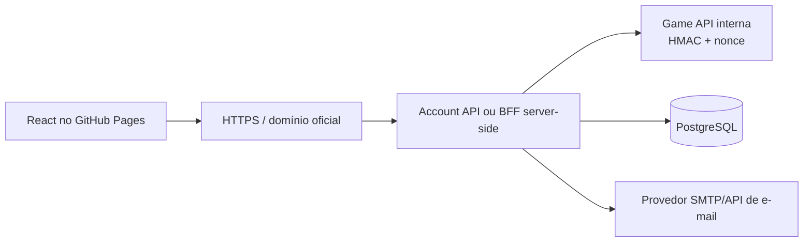

# Portal de contas

## Decisão

O frontend é React/Vite e é publicado como conteúdo estático no GitHub Pages,
no repositório independente
[`L2-NewEra-Frontend`](https://github.com/VictorAlmeida92/L2-NewEra-Frontend).
O GitHub Pages não executa backend, não envia e-mails e não pode guardar
segredos.

## Contratos

- o browser nunca recebe `GameApiSecret`;
- o browser nunca acessa JDBC ou PostgreSQL;
- a Game API continua privada, preferencialmente em `127.0.0.1` ou rede
  interna do deployment;
- o Account API valida entrada, limita tentativas e cria a sessão web;
- tokens de verificação e reset são de uso único, têm expiração e são salvos
  somente como hash;
- o login do jogo continua sendo validado pelo LoginServer; a sessão do portal
  não substitui o protocolo do cliente.

## Estado atual

O servidor possui `/internal/site/register`, `/internal/site/login` e
`/internal/site/account/change-password`, protegidos por HMAC. Esse contrato é
adequado para uma chamada server-to-server, não para ser chamado diretamente
pelo JavaScript público.

O endpoint atual de `reset-password` não é um fluxo de recuperação por e-mail:
ele recebe login e nova senha. Ele não deve ser exposto publicamente até ser
substituído por tokens de recuperação.

## Account API inicial

A primeira implementação server-side está no módulo Kotlin/Netty existente,
sem introduzir Spring, Ktor ou outro framework. Nesta etapa ela roda no mesmo
processo do GameServer, em uma porta separada, para reduzir risco operacional;
o contrato permite extraí-la para um serviço próprio posteriormente.

Rotas implementadas:

| Método | Rota | Autenticação |
|---|---|---|
| `GET` | `/api/account/health` | nenhuma, apenas health check local |
| `POST` | `/api/account/register` | nenhuma; rate limit e validação |
| `POST` | `/api/account/login` | credenciais; retorna sessão opaca |
| `GET` | `/api/account/me` | `Authorization: Bearer` |
| `POST` | `/api/account/logout` | `Authorization: Bearer` |
| `POST` | `/api/account/change-password` | sessão + senha atual |

Por padrão, `AccountApiEnabled = False` e o bind permitido é loopback. Para
produção, o endpoint deve ficar atrás de TLS, reverse proxy, rate limiting de
borda e domínio permitido por `AccountApiAllowedOrigins`.

A sessão é mantida em memória nesta primeira entrega; reiniciar o GameServer
invalida as sessões web. Persistência de sessão, verificação de e-mail e reset
por token são deliberadamente deixados para a próxima etapa.

## Separação de repositórios

O frontend já foi extraído e publicado em:

- repositório: <https://github.com/VictorAlmeida92/L2-NewEra-Frontend>;
- site: <https://victoralmeida92.github.io/L2-NewEra-Frontend/>.

O repositório `L2-NewEra` permanece responsável pelo GameServer, LoginServer,
Account API e infraestrutura Docker. A URL do frontend é configuração de borda;
ela não transforma a Account API local em endpoint público.

## Próxima entrega

A próxima branch deverá criar as migrations e o serviço de recuperação:

- e-mail normalizado e verificado por conta;
- tokens de verificação e reset;
- expiração, uso único e invalidação;
- integração com provedor de e-mail por secret externo;
- testes de persistência e segurança.
