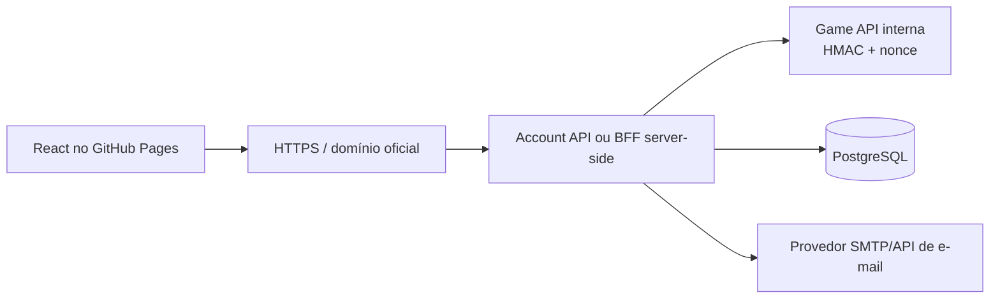

# Portal de contas

## Decisão

O frontend será React/Vite e será publicado como conteúdo estático no GitHub
Pages. O GitHub Pages não executa backend, não envia e-mails e não pode guardar
segredos.

## Contratos

- o browser nunca recebe `GameApiSecret`;
- o browser nunca acessa JDBC ou PostgreSQL;
- a Game API continua privada, preferencialmente em `127.0.0.1` ou rede
  interna do deployment;
- o Account API valida entrada, limita tentativas e cria a sessão web;
- tokens de verificação e reset são de uso único, têm expiração e são salvos
  somente como hash;
- o login do jogo continua sendo validado pelo LoginServer; a sessão do portal
  não substitui o protocolo do cliente.

## Estado atual

O servidor possui `/internal/site/register`, `/internal/site/login` e
`/internal/site/account/change-password`, protegidos por HMAC. Esse contrato é
adequado para uma chamada server-to-server, não para ser chamado diretamente
pelo JavaScript público.

O endpoint atual de `reset-password` não é um fluxo de recuperação por e-mail:
ele recebe login e nova senha. Ele não deve ser exposto publicamente até ser
substituído por tokens de recuperação.

## Próxima entrega

A próxima branch deverá criar as migrations e o serviço de recuperação:

- e-mail normalizado e verificado por conta;
- tokens de verificação e reset;
- expiração, uso único e invalidação;
- integração com provedor de e-mail por secret externo;
- testes de persistência e segurança.
