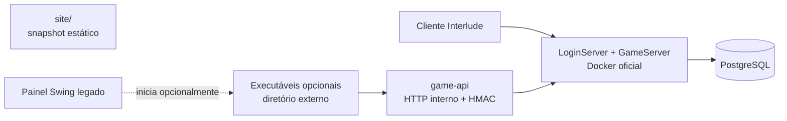

# Fronteiras de componentes e legado

Atualizado em 2026-09-30. Este documento registra o quinto bloco da Fase 4.1 e
distingue o servidor oficial de componentes opcionais, snapshots e ferramentas
legadas.

## Mapa de fronteiras

## Classificação comprovada

| Componente | Conteúdo observado | Consumidor comprovado | Runtime oficial |
|---|---|---|---|
| `site/` | 128,07 MB; 14.501 arquivos preexistentes, quase todos imagens, além de HTML/TSX | Nenhum consumidor de filesystem comprovado | Não |
| Diretório externo de ferramentas | `site-native.exe` e `cloudflared.exe`, quando configurados | `ProcessManagerService` do painel Swing | Não |
| `libs/` | 125,53 MB de dependências vendorizadas e checksums | Gradle, fat JAR, launchers diretos e extensões | Sim, parcialmente |
| `tools/` | runtime oficial, SQL legado, rede e scripts one-shot | Desenvolvimento/administração | Somente `tools/runtime/` |
| `brproject-data/` | exemplos de configuração remanescentes | scripts/painel de preparação legados | Não no Compose |

## Decisões

### Site e Game API

`modules/game-api` é parte do servidor e define o contrato de integração. A
pasta `site/` não é esse módulo: é somente uma entrega estática sem consumidor
comprovado no código. Um site deve consumir a Game API autenticada e não
receber credenciais JDBC nem compartilhar o schema como contrato de aplicação.

O Compose oficial não inicia o site porque não há, neste repositório, uma fonte
capaz de reproduzir `site-native.exe`, nem evidência de que o executável leia o
snapshot `site/`. A futura inclusão exige código-fonte, testes do contrato HTTP,
imagem própria, healthcheck e configuração explícita.

### Ferramentas opcionais do painel

`site-native.exe` e `cloudflared.exe` não pertencem ao repositório do servidor.
Quando o painel Swing legado for usado, os executáveis podem ser fornecidos por
um diretório externo configurado com `-Dl2newera.optionalToolsDir`, pela variável
`L2NEWERA_OPTIONAL_TOOLS_DIR` ou pela preferência local `OPTIONAL_TOOLS_DIR`.
O Docker oficial não inicia nem distribui essas ferramentas.

### Client patch e HWID

O material de patch do cliente foi removido deste repositório. Ele não deve ser
confundido com o código de proteção HWID do GameServer, que continua em
`modules/game-server-core/src/main/java/ext/mods/protection/hwid`.

### Bibliotecas

`libs/` ainda cruza build e runtime legado. O fat JAR é reproduzível e não é
versionado, mas as dependências vendorizadas só poderão sair depois que cada
consumidor tiver uma dependência Gradle ou artefato publicado equivalente.

## Regras de dependência

1. Docker oficial pode consumir fonte, `game/`, `login/`, `database/`,
   `deploy/` e dependências de `libs/`, mas não ferramentas externas ou `site/`.
2. O núcleo do servidor não pode passar a ler arquivos de `site/` nem material
   do client patch.
3. Integrações web passam por `modules/game-api`; acesso direto do site ao JDBC
   não é um contrato suportado.
4. Novos scripts operacionais entram em `tools/runtime/`.
5. Alterar ferramentas externas exige procedência, assinatura e revisão explícita;
   elas não devem voltar a ser versionadas na raiz do servidor.

Essas regras são verificadas por `checkComponentBoundaries` no build Gradle.
