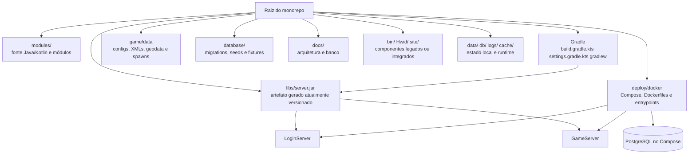

# Inventário estrutural do L2 NewEra

Atualizado em 2026-09-30. Este documento é o ponto de partida da Fase 4.1 —
normalização estrutural do projeto.

## Objetivo

Separar claramente código-fonte, configuração, dados versionáveis, runtime,
artefatos gerados, ferramentas e componentes legados sem alterar o protocolo
ou o comportamento do jogo durante a primeira etapa.

Esta PR é somente de inventário e decisão. Nenhuma pasta é movida ou removida
por aparência.

## Mapa atual



## Classificação

| Área | Papel atual | Classificação | Decisão |
|---|---|---|---|
| `modules/` | Código Java/Kotlin e módulos opcionais | Fonte | Manter como fonte principal; não reorganizar pacotes nesta fase |
| `build.gradle.kts`, `settings.gradle.kts`, `gradle/`, `gradlew*` | Compilação e composição | Build | Manter na raiz; serão a fonte oficial de builds reproduzíveis |
| `game/data/` | XMLs, configurações, spawns e geodata | Dados/configuração versionáveis | Manter; separar runtime em regras específicas, não pela extensão |
| `database/` | Migrations, seeds, fixtures e metadados do banco oficial | Dados de banco versionáveis | Origem canônica do Compose e dos testes |
| `deploy/docker/` | Dockerfiles, Compose e entrypoints | Deployment | Manter como caminho oficial; validar clone limpo antes de alterar |
| `docs/` | Documentação mantida pelo projeto | Documentação | Manter documentação arquitetural e de banco versionada |
| `libs/server.jar` | Fat JAR produzido por `:app-dist:jar` | Artefato gerado | Remover do Git em etapa própria após adaptar Docker/scripts |
| `libs/*.jar` exceto `server.jar` | Bibliotecas vendorizadas e integrações sem artefato Maven equivalente | Dependência vendorizada | Não remover automaticamente; catalogar origem/licença e migrar gradualmente |
| `data/`, `db/`, `logs/`, caches e WAL/SHM | Bancos locais, logs e estado de execução | Runtime | Não versionar; preservar somente migrations, seeds e fixtures necessárias |
| `bin/` | `cloudflared.exe` e `site-native.exe` | Ferramenta/legado | Mapear consumidores antes de separar ou remover |
| `Hwid/` | `Capturar.JPG` e configuração/artefato de HWID | Legado/ferramenta | Identificar uso real antes de mover; não faz parte do núcleo do servidor |
| `site/` | Código e artefatos do site integrado | Componente integrado | Documentar fronteira; extração para outro repositório é decisão futura |
| `tools/runtime/` e `StartL2NewEra.*` | Interface operacional Docker | Ferramenta oficial | Manter como contrato canônico de build/start/stop/status/logs |
| demais scripts `.bat`, `.sh`, `.ps1`, `.vbs`, `.command` | Inicialização direta por JAR e compatibilidade de ambientes | Wrappers legados | Manter enquanto houver consumidores na GUI, Gradle e classes Java; não usar como runtime oficial |

## Dependências críticas encontradas

1. `modules/app-dist/build.gradle.kts` gera o fat JAR diretamente em
   `libs/server.jar`.
2. Os Dockerfiles de LoginServer, GameServer e migrations copiam
   `libs/server.jar`; portanto um clone limpo ainda não consegue executar
   `docker compose build` sem uma etapa de build dentro do Docker ou um
   artefato publicado.
3. O GameServer ainda usa algumas bibliotecas vendorizadas de `libs/`, como
   `DeepL.jar`, `ApiPix.jar`, `Kamaloka.ext.jar` e `interface.ext.jar`.
4. `deploy/docker/docker-compose.yml` usa PostgreSQL e o serviço `migrate`
   executa as migrations antes de LoginServer/GameServer.
5. `game/data/geodata/` é dado operacional versionado e não deve ser tratado
   como cache descartável. A política de distribuição será definida junto com
   a política de artefatos pesados.

## Política de artefatos proposta

```text
fonte + configs + migrations + dados necessários
                ↓
        Gradle reproduzível
                ↓
      server.jar fora do Git
                ↓
 Docker build / GitHub Release / registry de imagens
```

Antes de remover `libs/server.jar` do índice, uma PR própria deve:

- adaptar os Dockerfiles para compilar ou receber explicitamente o artefato;
- adaptar scripts locais que pressupõem sua existência;
- validar `clone limpo → build → migrations → Compose → LoginServer → GameServer`;
- adicionar a regra de ignore somente depois que o pipeline reproduzível estiver
  funcionando;
- preservar checksums e metadados das dependências vendorizadas sem commitar
  estado de execução.

## Sequência das próximas PRs da Fase 4.1

1. Inventário e mapa estrutural — esta PR.
2. Política de artefatos e remoção segura do `server.jar` versionado.
3. Consolidação de migrations, seeds e fixtures.
4. Wrapper oficial de build/start/deploy, mantendo compatibilidade temporária — concluído em `feature/47-official-runtime-scripts`.
5. Isolamento documentado de site, ferramentas e componentes legados.
6. CI, publicação reproduzível e validação de clone limpo.

## Riscos conhecidos

- Remover `server.jar` antes de alterar os Dockerfiles quebra o build do
  Compose.
- Ignorar toda a pasta `game/data` perderia geodata e configurações necessárias
  ao jogo; a separação precisa ser feita por responsabilidade.
- Mover `site/`, `bin/` ou `Hwid/` sem busca de referências pode quebrar scripts
  administrativos e o fluxo local.
- Tratar bibliotecas vendorizadas como lixo pode remover integrações que não são
  substituíveis imediatamente por dependências Maven.
