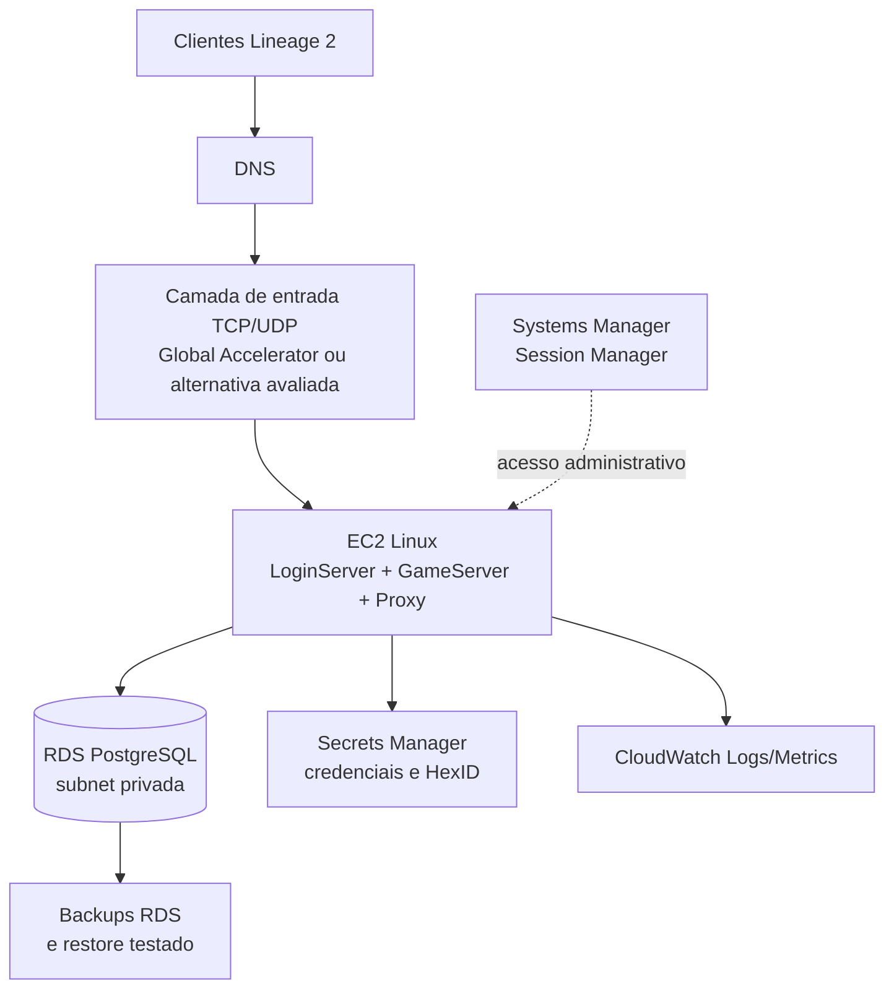

# Fase 5 — contrato de produção

Este documento define o contrato mínimo para levar o L2 NewEra de um ambiente
local Docker para uma operação controlada em AWS. Ele não cria recursos AWS,
não contém credenciais e não autoriza deploy automático. A implementação de
infraestrutura deve acontecer depois que os critérios abaixo forem validados.

## Objetivo da primeira etapa

Separar claramente:

- o artefato imutável da aplicação;
- o banco persistente;
- a rede pública e privada;
- segredos e configurações;
- logs, métricas e acesso operacional;
- testes que autorizam uma publicação.

O primeiro ambiente pode manter LoginServer, GameServer e Proxy na mesma EC2
para reduzir custo e complexidade. Isso não deve transformar o banco em um
processo local da EC2: o banco oficial de produção deve ser PostgreSQL
gerenciado, preferencialmente RDS, em subnets privadas.

## Topologia-alvo inicial

O site e o fórum não fazem parte do primeiro deployment do jogo. Quando
entrarem em produção, devem ter deployment e ciclo de atualização próprios e
consumir a `game-api`, sem acesso JDBC ao banco do jogo.

## Contratos obrigatórios

### Imagem e release

- O commit aprovado gera as imagens `login-server`, `game-server` e `migrate`.
- A publicação deve usar tag imutável por commit ou release, além do digest da
  imagem.
- `latest` não é uma referência suficiente para produção.
- `libs/server.jar` continua sendo artefato gerado, não arquivo de entrada do
  deploy.
- A imagem precisa ser construída pela CI a partir de checkout limpo.

### Banco e migrations

- PostgreSQL é o banco oficial.
- RDS não deve possuir IP público.
- Security Group permite acesso somente a partir da EC2 da aplicação e de um
  caminho administrativo controlado.
- O serviço `migrate` deve executar antes do LoginServer/GameServer.
- Uma migration deve ser idempotente do ponto de vista operacional e possuir
  estratégia de rollback ou procedimento de restauração documentado.
- Backup sem teste de restauração não é considerado backup validado.

### Segredos

Os seguintes valores não podem ser gravados no Git, na imagem ou em logs:

- senha do PostgreSQL;
- credencial do usuário de aplicação;
- HexID de produção;
- tokens de APIs externas;
- chaves de integração do site.

O `.env.example` é somente um modelo local. Em produção, os valores devem
vir de Secrets Manager ou mecanismo equivalente e ser injetados no runtime.

### Rede e acesso

- Somente as portas necessárias do jogo devem ser públicas.
- A porta do PostgreSQL deve permanecer privada.
- SSH público não é o caminho padrão; preferir Session Manager.
- Bastion só deve ser criado caso exista uma necessidade operacional concreta.
- WAF protege HTTP/HTTPS; não substitui proteção para o protocolo TCP/UDP do
  jogo.
- A estratégia anti-DDoS deve ser testada com o provedor antes de anunciar o
  servidor.

### Observabilidade

Antes do primeiro grupo de jogadores, precisamos ter:

- logs do LoginServer, GameServer e migrations enviados para retenção definida;
- métricas de CPU, memória, disco, conexões, pool JDBC e latência do banco;
- alertas para processo parado, porta indisponível, erro de migration e falta
  de espaço;
- correlação entre versão da imagem, commit e janela de deploy;
- procedimento de coleta de logs sem acessar diretamente o banco dos jogadores.

## Critérios de aceite da Fase 5.1

Esta etapa estará concluída quando:

1. a topologia de produção estiver aprovada;
2. os segredos exigidos estiverem listados sem valores reais;
3. houver uma imagem identificada por commit e digest;
4. uma restauração de backup PostgreSQL for executada em ambiente isolado;
5. o deployment puder ser revertido para a imagem anterior;
6. os logs e alertas mínimos estiverem definidos;
7. um teste de carga justificar a classe da EC2 para a população pretendida;
8. nenhum recurso AWS for criado diretamente por uma alteração de código sem
   revisão de infraestrutura.

## Sequência das próximas etapas

1. publicar imagens imutáveis no GHCR e registrar SBOM/procedência;
2. criar configuração de deployment sem segredos e validar com Compose;
3. executar restore drill das migrations e do PostgreSQL;
4. medir capacidade com carga controlada antes de escolher a EC2;
5. definir observabilidade e runbook operacional;
6. estudar VPC, RDS, Session Manager, entrada TCP/UDP e mitigação DDoS;
7. somente depois criar IaC e o ambiente AWS de homologação.

Até a conclusão desses critérios, o Docker local continua sendo o ambiente
oficial de desenvolvimento e validação.
